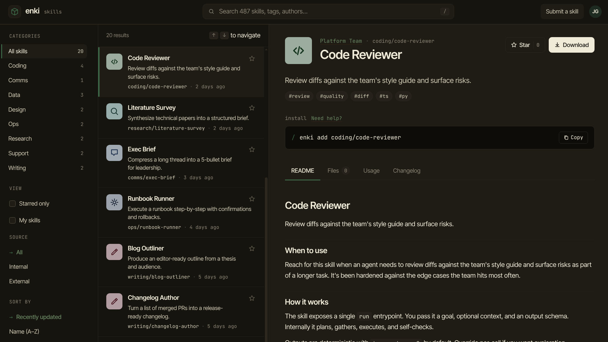

<div align="center">

# Enki

### The self-hosted AI skills library for teams

Stop losing great Claude skills to private folders and forgotten chat threads.  
Enki gives your team one searchable, versioned, always-available home for every skill you build.

[](LICENSE)
[](https://hub.docker.com/r/jez500/enki)

</div>

---



---

## The problem with sharing AI skills

Every team building with Claude hits the same wall: someone writes a brilliant skill, uses it for a week, then it disappears. It lives in a private Claude project, a Slack message, a random file on someone's laptop. The next person who needs it builds it from scratch — or doesn't build it at all because they didn't know it existed.

There's no shared library. No way to discover what your team has already built. No version history. No install button.

**Enki fixes that.**

---

## What Enki does

Enki is a self-hosted web app that works like an internal app store for Claude skills. Your team publishes skills to a shared library. Everyone else can browse them, read the docs, and install them into Claude with a single command.

It's built for teams that are serious about AI — where skills are real, reusable assets worth maintaining and sharing, not throwaway prompts.

### Browse and discover

A searchable, filterable library of every skill your team has published. Full-text search across names, tags, summaries, and documentation. Keyboard navigation. Category sidebar. Starred favourites. You'll find what you need in seconds.

### Everything a skill needs

Each skill gets its own page with a README, usage guide, changelog, file manifest, and activity log. Not just a description — proper documentation, the same way you'd expect from an open-source package.

### One-click install

Every skill shows a ready-to-paste install command. Your teammates go from discovery to installed in under a minute.

### Import from anywhere

Upload a `.zip` archive directly, or point Enki at a GitHub repository. Public repos work out of the box; private repos work with a personal access token. Enki can also keep GitHub-sourced skills automatically in sync with their upstream source.

### Built for teams

Role-based access (member / admin), per-user starred skills, private skills visible only to their creator, and a full admin panel for managing users. Google SSO with optional domain restriction so only your company can sign in. Everything you need to run this properly for a real team.

### Your data, your server

Enki runs entirely on your infrastructure. No cloud accounts, no data leaving your network, no per-seat pricing. SQLite out of the box, MySQL / MariaDB when you need it.

---

## Quick install

You need Docker. That's it.

**1. Download the compose file**

```bash
curl -O https://raw.githubusercontent.com/jez500/enki/main/docker-compose.yml
```

**2. Start Enki**

```bash
docker compose up -d
```

Open **http://localhost:8080**. Enki is running.

**3. Create your admin account**

Register through the app, then promote your account:

```bash
docker compose exec app php artisan user:assign-admin your@email.com
```

An **Admin** link appears in the top-right avatar menu. From there you can manage your team, invite colleagues, and set roles.

---

## Keeping it up to date

```bash
docker compose pull && docker compose up -d
```

Skills and users live in named Docker volumes and survive every update untouched.

---

## Feature highlights

| | |
|---|---|
| **Full-text search** | Search names, slugs, tags, and summaries instantly with keyboard navigation |
| **Categories** | Organise skills into custom groups with icons and colours |
| **Skill detail pages** | README · Usage guide · Changelog · File manifest · Activity log |
| **GitHub import** | Pull from any public or private GitHub repository |
| **GitHub sync** | Keep imported skills automatically up to date with their source |
| **Zip upload** | Submit a packaged skill without needing a repo |
| **Versioned changelogs** | Track what changed and when across every skill update |
| **Starring** | Every user has their own list of bookmarked skills |
| **Private skills** | Skills visible only to their creator — for drafts or sensitive work |
| **Admin panel** | Manage users, assign roles, and remove accounts from a built-in UI |
| **Google SSO** | Optional Google sign-in with domain restriction — or use email/password |
| **MySQL / MariaDB** | Switch from SQLite to MySQL with a few environment variables |
| **Dark mode** | Per-user theme and accent colour stored in the browser |
| **Self-hosted** | Runs on any server or VM; no external services required |

---

## Documentation

- [Configuration & environment variables](docs/configuration.md)
- [Google SSO setup](docs/SSO_SETUP.md)
- [MySQL / MariaDB setup](docs/configuration.md#mysql--mariadb)
- [Admin panel](docs/admin.md)
- [Local development & contributing](docs/development.md)
